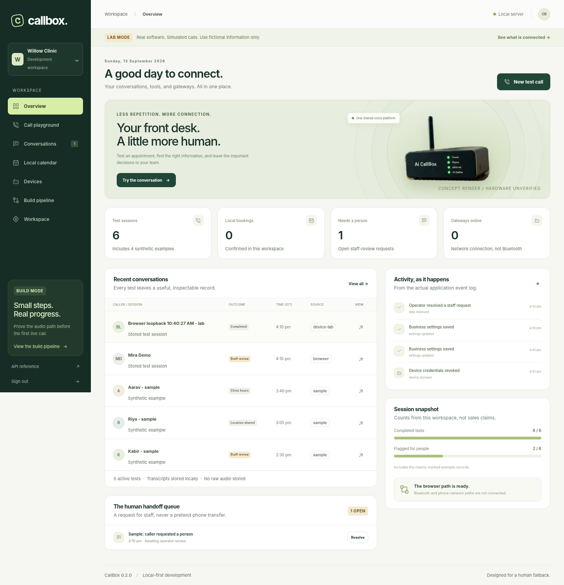

# CallBox Platform

**Same number, new possibilities. Build the software first. Prove the phone path next.**

Version **0.2.0** is a runnable, local-first development platform for the CallBox idea: an operator console, persistent receptionist workflows, an authenticated audio gateway, and a device simulator. It extends the earlier product website rather than replacing it.



> This is a software laboratory, not a deployed telephone receptionist. No phone, SIM, ESP32, carrier, Google Calendar, or WhatsApp account is connected. Use fictional data. Paid speech is disabled until you supply a server-side key and explicitly opt in.

## Start in a terminal

Requires **Python 3.11 or later**. Tested here with Python 3.13.5. Internet access is needed to install dependencies on your computer.

```bash
cd callbox-platform
python -m venv .venv
source .venv/bin/activate
python -m pip install -r requirements.txt
python -m callbox
```

On Windows PowerShell, activate with `.venv\Scripts\Activate.ps1`. On systems where `python` is Python 2 or missing, use `python3` for the initial command.

Open **http://127.0.0.1:8787/app/** and select **Open local demo**. The product website is at `/`; the API reference is at `/docs` and the machine-readable schema at `/openapi.json`.

The first run creates `.runtime/callbox.db` and an administrator token in `.runtime/admin-token`. Four synthetic conversation examples are clearly marked. Real test sessions and bookings are saved locally; they survive a server restart. Active test calls are ended on restart rather than falsely reported as connected.

Node.js is optional. `npm run dev` starts the same Python server after you install the Python requirements; there is no npm dependency installation step. This project uses FastAPI, SQLite, and modular browser JavaScript, not React or Next.js.

## Try an actual workflow

Open **Call playground**, choose local rules, enter a fictional caller label and start a test. Send:

```text
What are your hours?
book tomorrow
1
Mira Demo
confirm
I would like a human
```

The booking appears in **Local calendar** only after the confirm action succeeds. The staff request appears on the overview. End the session; inspect or export the transcript under **Conversations**. Active browser sessions can be resumed or ended from their record dialog. Cancelling a local appointment requires a separate operator confirmation.

The local parser is intentionally narrow. Unknown requests are sent to the staff queue. It is not a general language model, a validated medical triage engine, or a simulated confidence score.

## What is implemented

| Area | Working behavior |
|---|---|
| Operator console | Responsive overview, call playground, searchable sessions, transcript export, calendar, staff queue, device identities, settings and implementation gates |
| Workflows | Actual SQLite writes, explicit booking confirmation, slot recheck, duplicate-request protection, scoped queries and local cancellation |
| Transport | Real authenticated WebSocket endpoint, fixed PCM framing, bounded audio buffers, echo, interruption epochs, end/disconnect handling and device revocation |
| Simulator | Native Python network client and a browser loopback test; neither places a phone call |
| Optional voice | Server-side OpenAI transcription, structured intent and speech-generation adapter; contract/mock tests, not live provider validation |
| Firmware support | Portable C audio-ring component with host-compiler tests; no working HFP driver or ESP32 image |
| Product site | The earlier interactive marketing site and its concept images, available alongside the application |
| Developer kit | Automated tests, OpenAPI schema, protocol reference, Docker/CI templates, security notes, roadmap and review prompts |

## What is not implemented or verified

No real telephone answering, Bluetooth pairing, carrier/SIP adapter, ESP-IDF build, physical handset recovery, real human call transfer, production authentication/RBAC, multi-tenant isolation certification, billing, Google Calendar OAuth/synchronization, WhatsApp/SMS, medical decision-making, production monitoring, or public deployment.

The paid adapter is **turn-based speech-to-text -> request interpretation -> tools -> text-to-speech**. It is not an OpenAI Realtime API implementation or a proven full-duplex voice agent. Device-mode interruption clears application playback; already committed bookings are not undone. A real device must independently clear its own queued audio.

## Verify the network audio path

With the server running and the Python environment active:

```bash
python scripts/device_simulator.py --frames 100 --output qa/my-loopback.json
```

This provisions a temporary device token, sends exact PCM frames over a real WebSocket, checks returned bytes, sends an interruption, exercises text tools, ends the session and revokes the token. It reads the automatically generated administrator token by default. With a configured administrator token, pass `--admin-token YOUR_LOCAL_TOKEN` or use a protected shell variable. Never publish the token or put it in a URL.

The console also has **Devices -> Run loopback**. It sends 50 synthetic frames. Local round-trip times are software-loopback measurements, not telephone or AI conversation latency claims.

## Optional paid speech

Copy `.env.example` to `.env`, set `OPENAI_API_KEY`, and restart. Start a new OpenAI-mode session and explicitly consent to processing synthetic test content. The browser can record up to 20 seconds per turn; WebSocket agent input is limited to 15 seconds per committed turn.

Keys stay on the backend. Model availability, cost, language quality and upstream retention must be checked for your account before use. No live paid requests were made while building this release. See [provider setup](docs/PROVIDERS.md).

## Tests and tooling

```bash
python -m pip install -r requirements-dev.txt
python -m pytest -q
python scripts/build.py
make -C firmware test
python -m playwright install chromium
python scripts/browser_smoke.py
```

`make` and a C11 compiler are needed only for the portable firmware component. Node.js is optional for the build's JavaScript syntax checks; it was available during verification. The browser script uses native localhost networking by default. The delivered browser evidence was obtained with `--relay` because the managed test browser blocks localhost and file navigation; that mode is explicitly described in [QA](docs/QA.md).

**Do not deploy just `build/web/` as the application.** It contains static assets only; the API/WebSocket server must also run. The old `CallBox-Website.html` is a self-contained product demo, not the new server-backed console.

## Project map

```text
callbox/                 Python API, database, agent, provider and gateway
web/app/                 Operator console
web/site/                Preserved interactive marketing website and images
firmware/                Tested portable C queue, not full device firmware
scripts/                 Simulator, build, retention and browser test harness
tests/                  Python regression and provider-contract tests
docs/                   Architecture, protocol, security, roadmap and QA
agents/                 Reusable implementation and critic prompts
qa/                     Actual test results and UI screenshots
.github/workflows/      CI template (not run remotely)
```

## Deployment and data

The default binds to loopback, uses demo sign-in, and is for a trusted local computer. Docker files are provided as a development template; the image was not built in this environment. Public hosting requires hardening and explicit configuration; merely turning off demo mode is not a production security review. Run one application worker. SQLite and in-memory gateway ownership are not a distributed service.

Transcripts, names, bookings and requests are persisted. Raw recordings and generated audio are not written to application storage. `python scripts/prune.py --days 30` is a dry run; add `--apply` to delete old ended-call transcripts/cache/events. Appointments and staff tasks retain their names and need separate deletion. Back up first; see [security and privacy](docs/SECURITY.md).

## Next engineering milestone

Prove a consented, two-way Bluetooth HFP audio loop on **one identified phone + one identified board + one pinned SDK**, without AI. The server and simulator give that experiment a defined target; they are not evidence that the phone side already works. Follow [the hardware lab guide](firmware/README.md).
